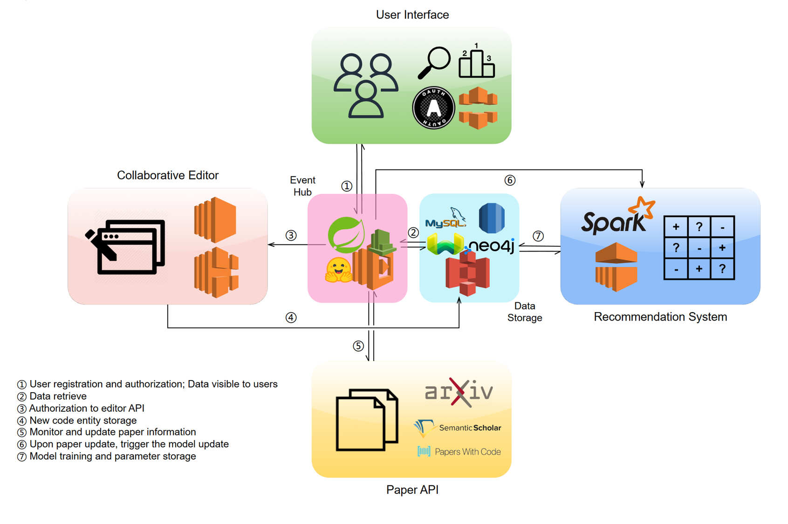
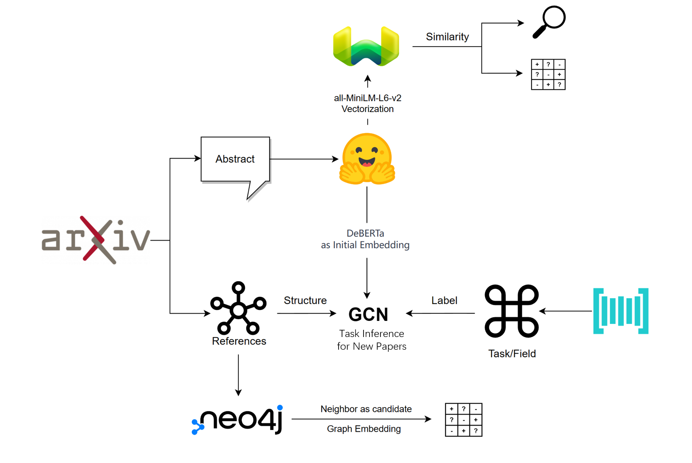

# DL2

Deep Learning Learning Platform

## Frontend

Uses Angular & Angular material to host a frontend. Angular material provides an
out-of-the-box development experience considering UI design.

### Features

- A seamless guide through deep learning papers nowadays, where you get customized recommendations based on browsing history and papers' citation graph, as well as access to a Markdown driven method introduction with only a few clicks.
- Graph visualisation: Uses D3, a graph engine with embedded physics engine that handles the forces among nodes.
- WebASM integrated LSP: Uses Jedi, Python language metatools to provide code autocompletions, embedded in JS using Pyodide.
- DataComp(beta) where you can upload datasets and compete with each other. The competition footprint can thus enhance our recommendation system.

## Backend

- Weaviate: Using Weaviate Vector Database API, we can retrieve the vector encoded by HuggingFace Model [all-MiniLM-L6-v2](https://huggingface.co/sentence-transformers/all-MiniLM-L6-v2), and find the objects closest to the query concepts.
- Neo4j: Neo4j is a graph database based on Cypher, which helps us find the neighbors of a paper on the citation graph with great convenience and performance.

## Data Analysis

- Recommendation System based on papers' citation graph and text data, and users' interest field.
- A GNN fine-grained field classifier for newly published papers.

## Demo Video

https://github.com/eicc27/DL2/assets/116665077/cb7a9db9-820e-41c8-b4cd-ab148e49e97f

## TODOs

- Autoscaler deployment of backend
- WSGI service of RFS
- Cache the python file in the frontend with IndexedDB
- New DataComp Recommendation System
- A ChatBot with OpenAI API

## Service as a Service(Secheduled)

- Kubernetes deployment with autoconfigured docker images
- ElasticSearch deployment with distributed ML searching capabilities
- Prometheus TSDB with advanced monitoring and logging of service statuses
